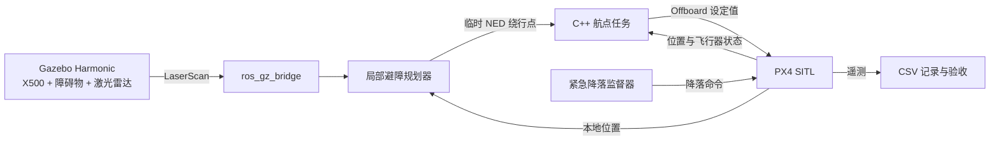
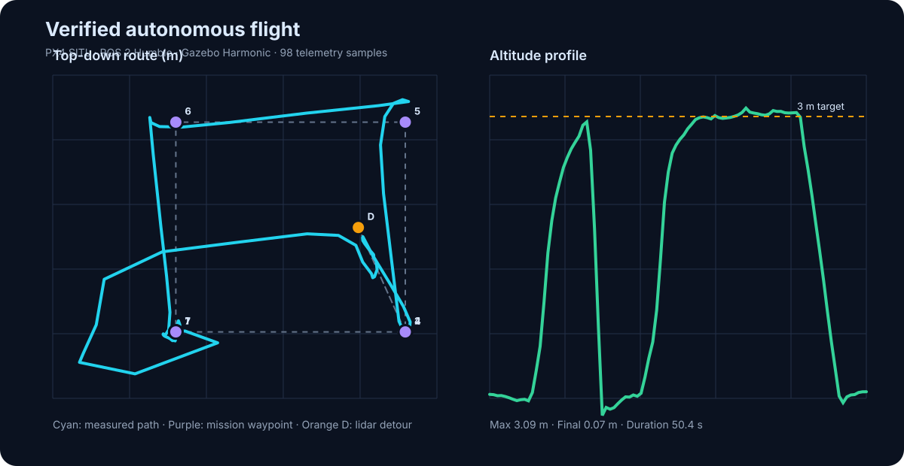

# AeroDock

[English](README.md) | [简体中文](README.zh-CN.md)

[](https://github.com/gongchuang01/AeroDock/actions/workflows/quality.yml)
[](https://github.com/gongchuang01/AeroDock/actions/workflows/docker.yml)

AeroDock 是一个基于 ROS 2 Humble、PX4 v1.16 和 Gazebo Harmonic 的无人机自主航点与激光雷达避障项目。

## 项目亮点

- 使用 C++17 实现 Offboard 任务状态机，覆盖预流、解锁、起飞、航点飞行、降落和故障转移。
- ROS 2 局部规划器处理二维激光雷达，包含多帧确认、安全高度门控、左右净空对比和 NED 坐标系绕行点生成。
- 遇到障碍物时临时插入绕行点，通过后自动恢复被中断的原航线。
- 串联 Gazebo 物理仿真、PX4 SITL、uXRCE-DDS、ROS 2 节点、RViz2 和 CSV 遥测分析。
- GitHub Actions 自动执行单元测试、真实遥测验收、干净 ROS 2 编译与 Docker 构建。

## 系统架构



## 已验证的集成结果

| 验收指标 | 结果 |
|---|---:|
| 完成航点 | 5 / 5 |
| 自动验收项 | 7 / 7 通过 |
| 绕行点最小误差 | 0.20 m |
| 最大高度 | 3.09 m |
| 降落后最终高度 | 0.07 m |
| 任务时长 | 50.4 s |
| 遥测样本 | 98 |



仓库保留了已验收飞行的原始遥测数据。无需启动 Gazebo 即可重新验收数据、计算指标并生成图表：

```bash
python3 tools/validate_avoidance.py artifacts/flight/verified-avoidance.csv
python3 tools/analyze_flight.py artifacts/flight/verified-avoidance.csv
python3 tools/render_flight_svg.py artifacts/flight/verified-avoidance.csv artifacts/flight/verified-avoidance.svg
```

## 技术栈

- Ubuntu 22.04
- ROS 2 Humble
- PX4 v1.16
- Gazebo Harmonic
- Micro XRCE-DDS Agent
- C++17 / rclcpp
- Python 3
- Docker / GitHub Actions

## 快速运行

先检查 ROS、PX4、DDS、显卡和磁盘环境：

```bash
./scripts/doctor.sh
```

启动普通仿真和任务：

```bash
./scripts/run_sitl.sh
./scripts/run_mission.sh
```

启动完整的激光雷达避障演示：

```bash
./scripts/run_obstacle_sim.sh
./scripts/run_avoidance_mission.sh
python3 tools/validate_avoidance.py ~/aerodock/logs/waypoint-flight.csv
./scripts/stop.sh
```

在 Ubuntu 桌面上查看 Gazebo 飞行和 RViz2 轨迹：

```bash
./scripts/run_visual_sim.sh
./scripts/run_visualization.sh
./scripts/run_waypoints.sh
```

## Docker 验证

Windows、macOS 和 Linux 用户可通过 Docker 复现 ROS 2 编译和规划器测试：

```bash
docker compose build
docker compose run --rm aerodock
```

Docker 镜像用于开发和验证；完整的 PX4 SITL 与 Gazebo 图形化演示使用 Ubuntu 22.04。

## 代码结构

- `src/aerodock_offboard`：航点控制、局部避障、安全监督与 RViz2 可视化节点。
- `simulation/worlds`：含障碍物的 Gazebo 世界。
- `tools`：遥测分析、验收和 SVG 图表生成工具。
- `tests`：不依赖 ROS 运行时的规划算法单元测试。
- `artifacts/flight`：已验收的飞行数据与可视化结果。
- `docs`：架构、飞行验证、避障、安全策略和 Docker 说明。

## 安全说明

`NAV_DLL_ACT=0` 只用于没有地面站的 SITL 仿真辅助脚本，不应用于真实飞行器。本项目是仿真与工程实践作品，并未针对实机飞行做安全认证。

## 许可证

[MIT](LICENSE)
